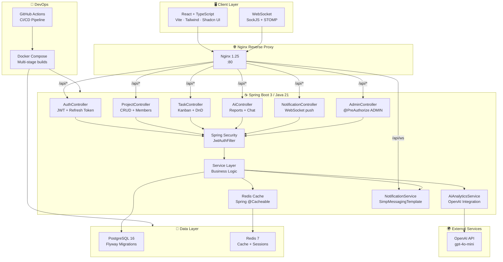

```mermaid
graph TB
    subgraph Client["🖥️ Client Layer"]
        UI["React + TypeScript\nVite · Tailwind · Shadcn UI"]
        WS_CLIENT["WebSocket\nSockJS + STOMP"]
    end

    subgraph Gateway["🌐 Nginx Reverse Proxy"]
        NGINX["Nginx 1.25\n:80"]
    end

    subgraph Backend["☕ Spring Boot 3 / Java 21"]
        AUTH["AuthController\nJWT + Refresh Token"]
        PROJ["ProjectController\nCRUD + Members"]
        TASK["TaskController\nKanban + DnD"]
        AI_CTRL["AiController\nReports + Chat"]
        NOTIF["NotificationController\nWebSocket push"]
        ADMIN["AdminController\n@PreAuthorize ADMIN"]

        SEC["Spring Security\nJwtAuthFilter"]
        SVC["Service Layer\nBusiness Logic"]
        CACHE["Redis Cache\nSpring @Cacheable"]

        AI_SVC["AiAnalyticsService\nOpenAI Integration"]
        WS_SVC["NotificationService\nSimpMessagingTemplate"]
    end

    subgraph Data["💾 Data Layer"]
        PG["PostgreSQL 16\nFlyway Migrations"]
        REDIS["Redis 7\nCache + Sessions"]
    end

    subgraph External["🌍 External Services"]
        OPENAI["OpenAI API\ngpt-4o-mini"]
    end

    subgraph DevOps["🔧 DevOps"]
        GHA["GitHub Actions\nCI/CD Pipeline"]
        DOCKER["Docker Compose\nMulti-stage builds"]
    end

    UI --> NGINX
    WS_CLIENT --> NGINX
    NGINX -->|"/api/*"| AUTH
    NGINX -->|"/api/*"| PROJ
    NGINX -->|"/api/*"| TASK
    NGINX -->|"/api/*"| AI_CTRL
    NGINX -->|"/api/*"| NOTIF
    NGINX -->|"/api/*"| ADMIN
    NGINX -->|"/api/ws"| WS_SVC

    AUTH --> SEC
    PROJ --> SEC
    TASK --> SEC
    AI_CTRL --> SEC
    NOTIF --> SEC
    ADMIN --> SEC

    SEC --> SVC
    SVC --> CACHE
    SVC --> AI_SVC
    SVC --> WS_SVC
    SVC --> PG
    CACHE --> REDIS
    AI_SVC --> OPENAI

    GHA --> DOCKER
    DOCKER --> Backend
    DOCKER --> Data
```
