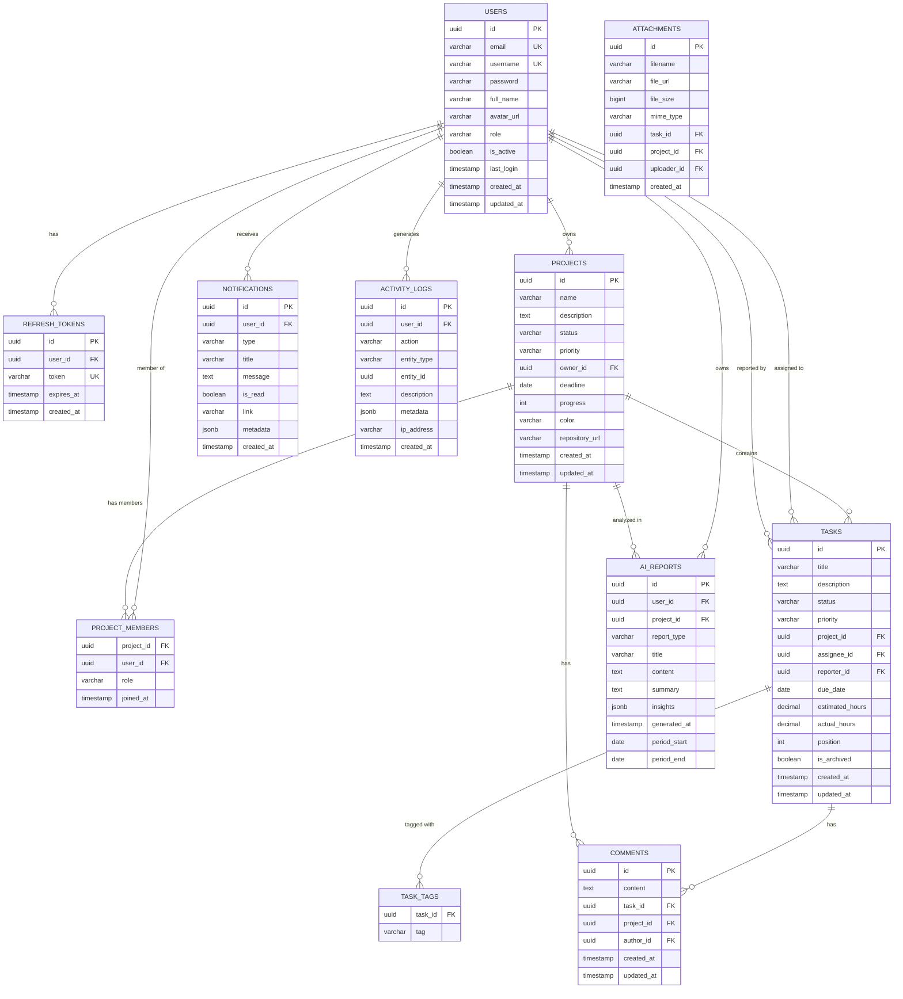

```mermaid
erDiagram
    USERS {
        uuid id PK
        varchar email UK
        varchar username UK
        varchar password
        varchar full_name
        varchar avatar_url
        varchar role
        boolean is_active
        timestamp last_login
        timestamp created_at
        timestamp updated_at
    }

    REFRESH_TOKENS {
        uuid id PK
        uuid user_id FK
        varchar token UK
        timestamp expires_at
        timestamp created_at
    }

    PROJECTS {
        uuid id PK
        varchar name
        text description
        varchar status
        varchar priority
        uuid owner_id FK
        date deadline
        int progress
        varchar color
        varchar repository_url
        timestamp created_at
        timestamp updated_at
    }

    PROJECT_MEMBERS {
        uuid project_id FK
        uuid user_id FK
        varchar role
        timestamp joined_at
    }

    TASKS {
        uuid id PK
        varchar title
        text description
        varchar status
        varchar priority
        uuid project_id FK
        uuid assignee_id FK
        uuid reporter_id FK
        date due_date
        decimal estimated_hours
        decimal actual_hours
        int position
        boolean is_archived
        timestamp created_at
        timestamp updated_at
    }

    TASK_TAGS {
        uuid task_id FK
        varchar tag
    }

    COMMENTS {
        uuid id PK
        text content
        uuid task_id FK
        uuid project_id FK
        uuid author_id FK
        timestamp created_at
        timestamp updated_at
    }

    ATTACHMENTS {
        uuid id PK
        varchar filename
        varchar file_url
        bigint file_size
        varchar mime_type
        uuid task_id FK
        uuid project_id FK
        uuid uploader_id FK
        timestamp created_at
    }

    NOTIFICATIONS {
        uuid id PK
        uuid user_id FK
        varchar type
        varchar title
        text message
        boolean is_read
        varchar link
        jsonb metadata
        timestamp created_at
    }

    ACTIVITY_LOGS {
        uuid id PK
        uuid user_id FK
        varchar action
        varchar entity_type
        uuid entity_id
        text description
        jsonb metadata
        varchar ip_address
        timestamp created_at
    }

    AI_REPORTS {
        uuid id PK
        uuid user_id FK
        uuid project_id FK
        varchar report_type
        varchar title
        text content
        text summary
        jsonb insights
        timestamp generated_at
        date period_start
        date period_end
    }

    USERS ||--o{ REFRESH_TOKENS : "has"
    USERS ||--o{ PROJECTS : "owns"
    USERS ||--o{ PROJECT_MEMBERS : "member of"
    PROJECTS ||--o{ PROJECT_MEMBERS : "has members"
    PROJECTS ||--o{ TASKS : "contains"
    USERS ||--o{ TASKS : "assigned to"
    USERS ||--o{ TASKS : "reported by"
    TASKS ||--o{ TASK_TAGS : "tagged with"
    TASKS ||--o{ COMMENTS : "has"
    PROJECTS ||--o{ COMMENTS : "has"
    USERS ||--o{ NOTIFICATIONS : "receives"
    USERS ||--o{ ACTIVITY_LOGS : "generates"
    USERS ||--o{ AI_REPORTS : "owns"
    PROJECTS ||--o{ AI_REPORTS : "analyzed in"
```
